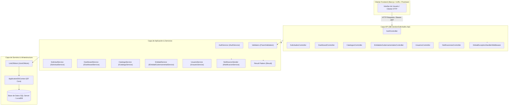
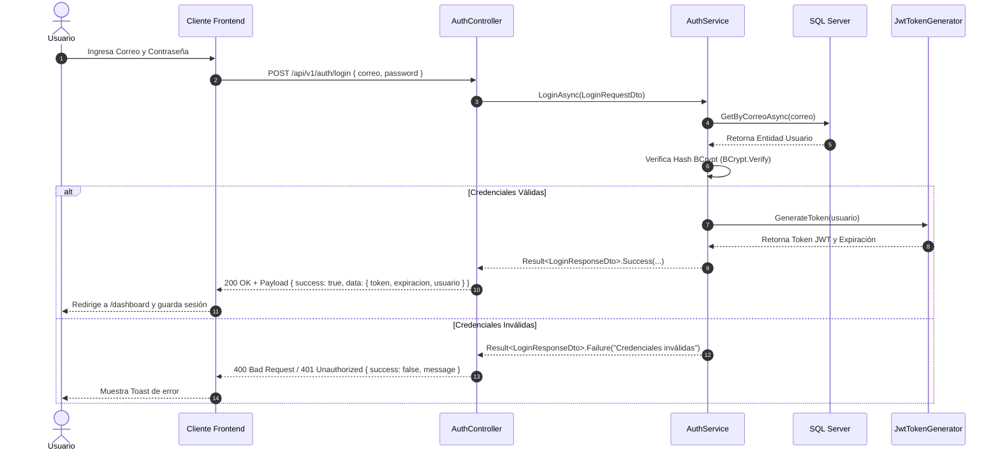
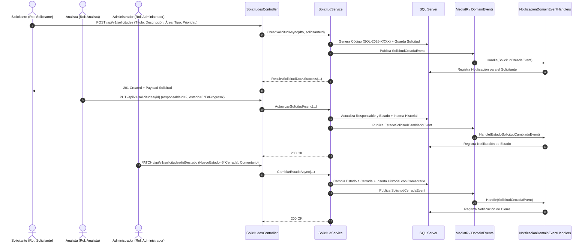

# 📖 Especificación Técnica y Documentación de la API REST

Documentación exhaustiva de la **API RESTful del Sistema de Gestión de Solicitudes Internas** de la Superintendencia de Bancos de la República Dominicana. Incluye arquitectura de interfaces, diagramas de flujo de procesos en Mermaid, catálogo completo de endpoints con sus esquemas de entrada/salida, parámetros de ruta y consulta, tablas de campos, ejemplos de peticiones cURL y payloads JSON reales.

---

## 🏛️ 1. Arquitectura de Interfaces de la API

La API sigue los principios de **Clean Architecture / Onion Architecture** y la especificación de diseño **RESTful (Level 2/3 Maturity Model)**.



---

## 🔄 2. Diagramas de Flujo de Procesos Clave

### 2.1 Flujo de Autenticación y Emisión de Token JWT


### 2.2 Flujo de Ciclo de Vida de una Solicitud y Eventos de Dominio


---

## 🛠️ 3. Estructura Estándar de Respuestas HTTP

Todas las respuestas de la API utilizan un envoltorio estándar homogéneo `ApiResponse<T>`:

### 🟢 Respuesta Exitosa (200 OK / 201 Created)
```json
{
  "success": true,
  "message": "Operación realizada exitosamente",
  "data": { ... },
  "errors": []
}
```

### 🔴 Respuesta de Error de Validación / Negocio (400 Bad Request)
```json
{
  "success": false,
  "message": "Se encontraron errores de validación.",
  "data": null,
  "errors": [
    "El título de la solicitud es obligatorio.",
    "La descripción no puede exceder los 2000 caracteres."
  ]
}
```

---

## 📌 4. Catálogo Detallado de Endpoints

```
Base URL Local: http://localhost:5000/api/v1
```

---

### 🔑 4.1 Módulo de Autenticación (`/api/v1/auth`)

#### `POST /api/v1/auth/login`
Autentica un usuario institucional y retorna el Token JWT de acceso con sus datos de perfil.

- **Autenticación:** No requerida (Pública).
- **Parámetros de Entrada (Body JSON):**

| Campo | Tipo | Requerido | Descripción |
|---|---|:---:|---|
| `correo` | `string` | Sí | Correo electrónico institucional del usuario (`admin@sb.gob.do`). |
| `password` | `string` | Sí | Contraseña en texto plano (`Admin123!`). |

- **Ejemplo de Petición cURL:**
```bash
curl -X POST "http://localhost:5000/api/v1/auth/login" \
  -H "Content-Type: application/json" \
  -d '{
    "correo": "admin@sb.gob.do",
    "password": "Admin123!"
  }'
```

- **Respuesta 200 OK:**
```json
{
  "success": true,
  "message": "Inicio de sesión exitoso.",
  "data": {
    "token": "eyJhbGciOiJIUzI1NiIsInR5cCI6IkpXVCJ9...",
    "expiracion": "2026-09-02T18:00:00Z",
    "usuario": {
      "id": 1,
      "nombre": "Administrador del Sistema",
      "correo": "admin@sb.gob.do",
      "rol": 1,
      "rolNombre": "Administrador",
      "activo": true
    }
  },
  "errors": []
}
```

---

### 📋 4.2 Módulo de Solicitudes (`/api/v1/solicitudes`)

#### `GET /api/v1/solicitudes`
Obtiene el listado paginado y filtrable de solicitudes de soporte técnico.

- **Autenticación:** Requerida (`Bearer Token`).
- **Roles Permitidos:** `Administrador`, `Analista`, `Solicitante`.
- **Parámetros de Consulta (Query Params):**

| Parámetro | Tipo | Requerido | Descripción |
|---|---|:---:|---|
| `estado` | `int?` | No | Filtro por ID de estado (`1`=Registrada, `2`=EnAnalisis, `3`=EnProgreso, `4`=EnEspera, `5`=Resuelta, `6`=Cerrada, `7`=Rechazada). |
| `prioridad` | `int?` | No | Filtro por prioridad (`1`=Baja, `2`=Media, `3`=Alta, `4`=Critica). |
| `areaId` | `int?` | No | Identificador del área operativa. |
| `solicitanteId` | `int?` | No | Identificador del usuario solicitante. |
| `responsableId` | `int?` | No | Identificador del analista asignado. |
| `search` | `string` | No | Búsqueda por texto libre en código, título o descripción. |
| `pageNumber` | `int` | No | Número de página (Valor por defecto: `1`). |
| `pageSize` | `int` | No | Cantidad de registros por página (Valor por defecto: `10`). |
| `sortBy` | `string` | No | Campo de ordenamiento (`fechaCreacion`, `prioridad`, `estado`, `codigo`). |
| `sortDescending` | `bool` | No | Orden descendente (`true` por defecto). |

- **Ejemplo de Petición cURL:**
```bash
curl -X GET "http://localhost:5000/api/v1/solicitudes?pageNumber=1&pageSize=10" \
  -H "Authorization: Bearer <TOKEN_JWT>"
```

- **Respuesta 200 OK:**
```json
{
  "success": true,
  "message": "Operación realizada exitosamente",
  "data": {
    "items": [
      {
        "id": 1,
        "codigo": "SOL-2026-0001",
        "titulo": "Acceso al módulo de reportes consolidados",
        "descripcion": "Se requiere asignar permisos de lectura en la plataforma de reportes bancarios para el nuevo analista.",
        "prioridad": 3,
        "prioridadNombre": "Alta",
        "estado": 3,
        "estadoNombre": "EnProgreso",
        "referenciaEvidencia": "https://intranet.sb.gob.do/ticket-ref/8821",
        "fechaCreacion": "2026-08-30T12:00:00Z",
        "fechaCompromiso": "2026-09-04T12:00:00Z",
        "fechaActualizacion": null,
        "solicitanteId": 3,
        "solicitanteNombre": "Juan Pérez",
        "responsableId": 2,
        "responsableNombre": "Carlos Mendoza (Analista IT)",
        "areaId": 1,
        "areaNombre": "Tecnología de la Información",
        "tipoSolicitudId": 3,
        "tipoSolicitudNombre": "Acceso a Sistemas",
        "estaVencida": false
      }
    ],
    "pageNumber": 1,
    "totalPages": 1,
    "totalCount": 1,
    "hasPreviousPage": false,
    "hasNextPage": false
  },
  "errors": []
}
```

---

#### `GET /api/v1/solicitudes/{id}`
Obtiene el detalle completo de una solicitud por su ID, incluyendo histórico de estados y comentarios.

- **Autenticación:** Requerida (`Bearer Token`).
- **Roles Permitidos:** `Administrador`, `Analista`, `Solicitante`.
- **Parámetros de Ruta (Route Params):**

| Parámetro | Tipo | Requerido | Descripción |
|---|---|:---:|---|
| `id` | `int` | Sí | Identificador único de la solicitud. |

- **Ejemplo de Petición cURL:**
```bash
curl -X GET "http://localhost:5000/api/v1/solicitudes/1" \
  -H "Authorization: Bearer <TOKEN_JWT>"
```

- **Respuesta 200 OK:**
```json
{
  "success": true,
  "message": "Operación realizada exitosamente",
  "data": {
    "id": 1,
    "codigo": "SOL-2026-0001",
    "titulo": "Acceso al módulo de reportes consolidados",
    "descripcion": "Se requiere asignar permisos de lectura en la plataforma de reportes bancarios para el nuevo analista.",
    "prioridad": 3,
    "prioridadNombre": "Alta",
    "estado": 3,
    "estadoNombre": "EnProgreso",
    "referenciaEvidencia": "https://intranet.sb.gob.do/ticket-ref/8821",
    "fechaCreacion": "2026-08-30T12:00:00Z",
    "fechaCompromiso": "2026-09-04T12:00:00Z",
    "fechaActualizacion": null,
    "solicitanteId": 3,
    "solicitanteNombre": "Juan Pérez",
    "responsableId": 2,
    "responsableNombre": "Carlos Mendoza (Analista IT)",
    "areaId": 1,
    "areaNombre": "Tecnología de la Información",
    "tipoSolicitudId": 3,
    "tipoSolicitudNombre": "Acceso a Sistemas",
    "estaVencida": false,
    "historiales": [
      {
        "id": 1,
        "solicitudId": 1,
        "estadoAnterior": null,
        "estadoAnteriorNombre": null,
        "estadoNuevo": 1,
        "estadoNuevoNombre": "Registrada",
        "usuarioId": 3,
        "usuarioNombre": "Juan Pérez",
        "comentario": "Solicitud creada por el usuario.",
        "fecha": "2026-08-30T12:00:00Z"
      }
    ],
    "comentarios": [
      {
        "id": 1,
        "solicitudId": 1,
        "usuarioId": 2,
        "usuarioNombre": "Carlos Mendoza (Analista IT)",
        "texto": "Se han revisado las políticas de acceso. En proceso de asignación de perfil.",
        "esPublico": true,
        "fecha": "2026-08-31T14:30:00Z"
      }
    ]
  },
  "errors": []
}
```

---

#### `POST /api/v1/solicitudes`
Registra una nueva solicitud de servicio en el sistema.

- **Autenticación:** Requerida (`Bearer Token`).
- **Roles Permitidos:** `Administrador`, `Analista`, `Solicitante`.
- **Parámetros de Entrada (Body JSON):**

| Campo | Tipo | Requerido | Descripción |
|---|---|:---:|---|
| `titulo` | `string` | Sí | Título descriptivo (máx. 150 caracteres). |
| `descripcion` | `string` | Sí | Detalle y justificación técnica del requerimiento (máx. 2000 caracteres). |
| `prioridad` | `int` | Sí | Nivel de urgencia (`1`=Baja, `2`=Media, `3`=Alta, `4`=Critica). |
| `areaId` | `int` | Sí | ID del área operativa solicitante. |
| `tipoSolicitudId` | `int` | Sí | ID del tipo de requerimiento. |
| `referenciaEvidencia` | `string?` | No | URL o ubicación de evidencia adjunta. |
| `fechaCompromiso` | `DateTime?`| No | Fecha límite estimada de entrega. |

- **Ejemplo de Petición cURL:**
```bash
curl -X POST "http://localhost:5000/api/v1/solicitudes" \
  -H "Authorization: Bearer <TOKEN_JWT>" \
  -H "Content-Type: application/json" \
  -d '{
    "titulo": "Actualización de certificado SSL en servidor de pruebas",
    "descripcion": "El certificado SSL expirará en 48 horas. Se requiere renovación y despliegue.",
    "prioridad": 3,
    "areaId": 1,
    "tipoSolicitudId": 1,
    "referenciaEvidencia": "https://srv-dev.sb.gob.do"
  }'
```

- **Respuesta 201 Created:**
```json
{
  "success": true,
  "message": "Solicitud creada exitosamente.",
  "data": {
    "id": 5,
    "codigo": "SOL-2026-0005",
    "titulo": "Actualización de certificado SSL en servidor de pruebas",
    "estado": 1,
    "estadoNombre": "Registrada"
  },
  "errors": []
}
```

---

#### `PUT /api/v1/solicitudes/{id}`
Actualiza los datos generales o asignación técnica de una solicitud existente.

- **Autenticación:** Requerida (`Bearer Token`).
- **Roles Permitidos:** `Administrador`, `Analista`.
- **Parámetros de Ruta:** `id` (`int`).
- **Parámetros de Entrada (Body JSON):**

| Campo | Tipo | Requerido | Descripción |
|---|---|:---:|---|
| `titulo` | `string` | Sí | Título actualizado. |
| `descripcion` | `string` | Sí | Descripción actualizada. |
| `prioridad` | `int` | Sí | Prioridad asignada (`1` a `4`). |
| `estado` | `int` | Sí | Estado del ciclo de vida (`1` a `7`). |
| `areaId` | `int` | Sí | ID del área. |
| `tipoSolicitudId` | `int` | Sí | ID del tipo de solicitud. |
| `responsableId` | `int?` | No | ID del analista asignado. |
| `referenciaEvidencia` | `string?` | No | Referencia o enlace de evidencia. |
| `fechaCompromiso` | `DateTime?`| No | Nueva fecha límite. |

- **Ejemplo de Petición cURL:**
```bash
curl -X PUT "http://localhost:5000/api/v1/solicitudes/1" \
  -H "Authorization: Bearer <TOKEN_JWT>" \
  -H "Content-Type: application/json" \
  -d '{
    "titulo": "Acceso al módulo de reportes consolidados",
    "descripcion": "Se requiere asignar permisos de lectura en la plataforma de reportes bancarios para el nuevo analista.",
    "prioridad": 3,
    "estado": 3,
    "areaId": 1,
    "tipoSolicitudId": 3,
    "responsableId": 2,
    "referenciaEvidencia": "https://intranet.sb.gob.do/ticket-ref/8821"
  }'
```

- **Respuesta 200 OK:**
```json
{
  "success": true,
  "message": "Solicitud actualizada correctamente.",
  "data": {
    "id": 1,
    "codigo": "SOL-2026-0001",
    "estadoNombre": "EnProgreso"
  },
  "errors": []
}
```

---

#### `PATCH /api/v1/solicitudes/{id}/estado`
Efectúa una transición en la máquina de estados de la solicitud con validación de reglas de negocio y comentario de auditoría.

- **Autenticación:** Requerida (`Bearer Token`).
- **Roles Permitidos:** `Administrador`, `Analista`.
- **Parámetros de Ruta:** `id` (`int`).
- **Parámetros de Entrada (Body JSON):**

| Campo | Tipo | Requerido | Descripción |
|---|---|:---:|---|
| `nuevoEstado` | `int` | Sí | Nuevo estado (`1` a `7`). |
| `comentario` | `string` | Sí | Justificación o nota explicativa del cambio de estado. |

- **Ejemplo de Petición cURL:**
```bash
curl -X PATCH "http://localhost:5000/api/v1/solicitudes/1/estado" \
  -H "Authorization: Bearer <TOKEN_JWT>" \
  -H "Content-Type: application/json" \
  -d '{
    "nuevoEstado": 5,
    "comentario": "Se configuraron los permisos de acceso en Active Directory y base de datos."
  }'
```

- **Respuesta 200 OK:**
```json
{
  "success": true,
  "message": "Estado de la solicitud actualizado exitosamente.",
  "data": {
    "id": 1,
    "codigo": "SOL-2026-0001",
    "estado": 5,
    "estadoNombre": "Resuelta"
  },
  "errors": []
}
```

---

#### `POST /api/v1/solicitudes/{id}/comentarios`
Agrega una nota o comentario de seguimiento a la solicitud.

- **Autenticación:** Requerida (`Bearer Token`).
- **Roles Permitidos:** `Administrador`, `Analista`, `Solicitante`.
- **Parámetros de Ruta:** `id` (`int`).
- **Parámetros de Entrada (Body JSON):**

| Campo | Tipo | Requerido | Descripción |
|---|---|:---:|---|
| `texto` | `string` | Sí | Contenido del comentario (máx. 1000 caracteres). |
| `esPublico` | `bool` | No | Visibilidad para el solicitante (`true` por defecto). |

- **Ejemplo de Petición cURL:**
```bash
curl -X POST "http://localhost:5000/api/v1/solicitudes/1/comentarios" \
  -H "Authorization: Bearer <TOKEN_JWT>" \
  -H "Content-Type: application/json" \
  -d '{
    "texto": "Las pruebas de conexión y validación de perfiles fueron satisfactorias.",
    "esPublico": true
  }'
```

- **Respuesta 201 Created:**
```json
{
  "success": true,
  "message": "Comentario agregado exitosamente.",
  "data": {
    "id": 3,
    "solicitudId": 1,
    "usuarioNombre": "Carlos Mendoza (Analista IT)",
    "texto": "Las pruebas de conexión y validación de perfiles fueron satisfactorias.",
    "esPublico": true,
    "fecha": "2026-09-02T13:00:00Z"
  },
  "errors": []
}
```

---

#### `GET /api/v1/solicitudes/{id}/historial`
Retorna la línea de tiempo completa de transiciones de estado de la solicitud.

- **Autenticación:** Requerida (`Bearer Token`).
- **Roles Permitidos:** `Administrador`, `Analista`, `Solicitante`.
- **Parámetros de Ruta:** `id` (`int`).

- **Ejemplo de Petición cURL:**
```bash
curl -X GET "http://localhost:5000/api/v1/solicitudes/1/historial" \
  -H "Authorization: Bearer <TOKEN_JWT>"
```

- **Respuesta 200 OK:**
```json
{
  "success": true,
  "message": "Operación realizada exitosamente",
  "data": [
    {
      "id": 1,
      "solicitudId": 1,
      "estadoAnterior": null,
      "estadoAnteriorNombre": null,
      "estadoNuevo": 1,
      "estadoNuevoNombre": "Registrada",
      "usuarioId": 3,
      "usuarioNombre": "Juan Pérez",
      "comentario": "Solicitud creada por el usuario.",
      "fecha": "2026-08-30T12:00:00Z"
    },
    {
      "id": 2,
      "solicitudId": 1,
      "estadoAnterior": 1,
      "estadoAnteriorNombre": "Registrada",
      "estadoNuevo": 3,
      "estadoNuevoNombre": "EnProgreso",
      "usuarioId": 2,
      "usuarioNombre": "Carlos Mendoza (Analista IT)",
      "comentario": "Solicitud tomada por el analista y puesta en progreso.",
      "fecha": "2026-08-31T14:30:00Z"
    }
  ],
  "errors": []
}
```

---

### 📊 4.3 Módulo de Dashboard y Métricas (`/api/v1/dashboard`)

#### `GET /api/v1/dashboard/metricas`
Obtiene las métricas institucionales consolidadas, KPIs de solicitudes por estado, prioridad y áreas operativas.

- **Autenticación:** Requerida (`Bearer Token`).
- **Roles Permitidos:** `Administrador`, `Analista`, `Solicitante`.

- **Ejemplo de Petición cURL:**
```bash
curl -X GET "http://localhost:5000/api/v1/dashboard/metricas" \
  -H "Authorization: Bearer <TOKEN_JWT>"
```

- **Respuesta 200 OK:**
```json
{
  "success": true,
  "message": "Operación realizada exitosamente",
  "data": {
    "totalSolicitudes": 4,
    "solicitudesRegistradas": 1,
    "solicitudesEnAnalisis": 0,
    "solicitudesEnProgreso": 1,
    "solicitudesEnEspera": 0,
    "solicitudesResueltas": 1,
    "solicitudesCerradas": 1,
    "solicitudesRechazadas": 0,
    "solicitudesVencidas": 0,
    "porEstado": [
      { "estado": "Registrada", "cantidad": 1, "porcentaje": 25.0 },
      { "estado": "EnProgreso", "cantidad": 1, "porcentaje": 25.0 },
      { "estado": "Resuelta", "cantidad": 1, "porcentaje": 25.0 },
      { "estado": "Cerrada", "cantidad": 1, "porcentaje": 25.0 }
    ],
    "porPrioridad": [
      { "prioridad": "Baja", "cantidad": 1, "porcentaje": 25.0 },
      { "prioridad": "Media", "cantidad": 1, "porcentaje": 25.0 },
      { "prioridad": "Alta", "cantidad": 1, "porcentaje": 25.0 },
      { "prioridad": "Critica", "cantidad": 1, "porcentaje": 25.0 }
    ],
    "porArea": [
      { "area": "Tecnología de la Información", "cantidad": 2, "porcentaje": 50.0 },
      { "area": "Finanzas y Contabilidad", "cantidad": 1, "porcentaje": 25.0 },
      { "area": "Operaciones Bancarias", "cantidad": 1, "porcentaje": 25.0 }
    ]
  },
  "errors": []
}
```

---

### 📚 4.4 Módulo de Catálogos del Sistema (`/api/v1/catalogos`)

#### `GET /api/v1/catalogos/areas`
Obtiene la lista de áreas institucionales.

- **Autenticación:** Requerida (`Bearer Token`).
- **Query Params:** `soloActivas` (`bool?`).
- **Respuesta 200 OK:**
```json
{
  "success": true,
  "message": "Operación realizada exitosamente",
  "data": [
    { "id": 1, "nombre": "Tecnología de la Información", "descripcion": "División de TI y Canales", "activa": true },
    { "id": 2, "nombre": "Finanzas y Contabilidad", "descripcion": "Departamento Financiero", "activa": true }
  ],
  "errors": []
}
```

#### `POST /api/v1/catalogos/areas`
Crea una nueva área institucional.

- **Autenticación:** Requerida (`Bearer Token`) — **Rol Exclusivo:** `Administrador`.
- **Body JSON:** `{ "nombre": "Auditoría Interna", "descripcion": "Control y aseguramiento", "activa": true }`.
- **Respuesta 201 Created:** Retorna el objeto `AreaDto` creado.

#### `PUT /api/v1/catalogos/areas/{id}`
Actualiza los datos de un área existente.

- **Autenticación:** Requerida (`Bearer Token`) — **Rol Exclusivo:** `Administrador`.
- **Body JSON:** `{ "nombre": "Auditoría Interna e Inspección", "descripcion": "Control y supervisión", "activa": true }`.

#### `PATCH /api/v1/catalogos/areas/{id}/toggle-estado`
Activa o desactiva lógicamente un área institucional.

- **Autenticación:** Requerida (`Bearer Token`) — **Rol Exclusivo:** `Administrador`.
- **Respuesta 200 OK:** `{ "success": true, "message": "Estado del área actualizado exitosamente.", "data": true }`.

---

#### `GET /api/v1/catalogos/tipos-solicitud`
Obtiene la lista de tipos de solicitud clasificados.

- **Autenticación:** Requerida (`Bearer Token`).
- **Query Params:** `soloActivos` (`bool?`).
- **Respuesta 200 OK:**
```json
{
  "success": true,
  "message": "Operación realizada exitosamente",
  "data": [
    { "id": 1, "nombre": "Soporte Técnico", "descripcion": "Asistencia en Hardware/Software", "activo": true },
    { "id": 2, "nombre": "Desarrollo de Software", "descripcion": "Nuevos requerimientos y ajustes", "activo": true }
  ],
  "errors": []
}
```

#### `POST /api/v1/catalogos/tipos-solicitud`
Crea un nuevo tipo de solicitud.

- **Autenticación:** Requerida (`Bearer Token`) — **Rol Exclusivo:** `Administrador`.
- **Body JSON:** `{ "nombre": "Ciberseguridad", "descripcion": "Análisis y desbloqueo de seguridad", "activo": true }`.
- **Respuesta 201 Created:** Retorna el objeto `TipoSolicitudDto` creado.

#### `PUT /api/v1/catalogos/tipos-solicitud/{id}`
Actualiza un tipo de solicitud.

- **Autenticación:** Requerida (`Bearer Token`) — **Rol Exclusivo:** `Administrador`.

#### `PATCH /api/v1/catalogos/tipos-solicitud/{id}/toggle-estado`
Activa o desactiva lógicamente un tipo de solicitud.

- **Autenticación:** Requerida (`Bearer Token`) — **Rol Exclusivo:** `Administrador`.

---

### 🏛️ 4.5 Módulo de Entidades Gubernamentales (`/api/v1/entidadesgubernamentales`)

#### `GET /api/v1/entidadesgubernamentales`
Consulta el catálogo de entidades públicas de la República Dominicana con filtros combinados y paginación.

- **Autenticación:** Requerida (`Bearer Token`).
- **Roles Permitidos:** `Administrador`, `Analista`, `Solicitante`.
- **Parámetros de Consulta (Query Params):**

| Parámetro | Tipo | Requerido | Descripción |
|---|---|:---:|---|
| `search` | `string` | No | Búsqueda por nombre o siglas. |
| `sector` | `string` | No | Filtro por sector estatal (ej. `Financiero`, `Hacienda`, `Salud`). |
| `poderEstado` | `string` | No | Filtro por poder (`Poder Ejecutivo`, `Poder Judicial`, etc.). |
| `categoria` | `string` | No | Filtro por categoría institucional. |
| `soloActivos` | `bool?` | No | Filtrar solo entidades activas. |
| `pageNumber` | `int` | No | Número de página (Default `1`). |
| `pageSize` | `int` | No | Registros por página (Default `10`). |

- **Ejemplo de Petición cURL:**
```bash
curl -X GET "http://localhost:5000/api/v1/entidadesgubernamentales?sector=Financiero&pageNumber=1&pageSize=5" \
  -H "Authorization: Bearer <TOKEN_JWT>"
```

- **Respuesta 200 OK:**
```json
{
  "success": true,
  "message": "Operación realizada exitosamente",
  "data": {
    "items": [
      {
        "id": 1,
        "nombre": "Superintendencia de Bancos de la República Dominicana",
        "categoria": "Organismo Descentralizado Funcionalmente",
        "poderEstado": "Poder Ejecutivo",
        "sector": "Financiero",
        "siglas": "SB",
        "direccion": "Av. México #52, Santo Domingo",
        "telefono": "809-685-8141",
        "sitioWeb": "https://sb.gob.do",
        "activo": true
      }
    ],
    "pageNumber": 1,
    "totalPages": 1,
    "totalCount": 1,
    "hasPreviousPage": false,
    "hasNextPage": false
  },
  "errors": []
}
```

---

#### `GET /api/v1/entidadesgubernamentales/{id}`
Obtiene el detalle de una entidad gubernamental por su ID.

- **Autenticación:** Requerida (`Bearer Token`).
- **Roles Permitidos:** `Administrador`, `Analista`, `Solicitante`.

#### `GET /api/v1/entidadesgubernamentales/filtros`
Obtiene las listas únicas de sectores, categorías y poderes del Estado presentes en la base de datos para alimentar los filtros de la interfaz.

- **Autenticación:** Requerida (`Bearer Token`).
- **Respuesta 200 OK:**
```json
{
  "success": true,
  "message": "Operación realizada exitosamente",
  "data": {
    "sectores": ["Financiero", "Hacienda", "Salud", "Educación", "Presidencia"],
    "categorias": ["Ministerio", "Organismo Descentralizado Funcionalmente", "Organismo Desconcentrado Funcionalmente"],
    "poderesEstado": ["Poder Ejecutivo", "Poder Judicial", "Poder Legislativo"]
  },
  "errors": []
}
```

---

#### `POST /api/v1/entidadesgubernamentales`
Registra una nueva entidad gubernamental en el catálogo.

- **Autenticación:** Requerida (`Bearer Token`) — **Rol Exclusivo:** `Administrador`.
- **Parámetros de Entrada (Body JSON):**

| Campo | Tipo | Requerido | Descripción |
|---|---|:---:|---|
| `nombre` | `string` | Sí | Nombre oficial de la institución (máx. 250 caracteres). |
| `categoria` | `string` | Sí | Clasificación institucional (máx. 150 caracteres). |
| `poderEstado` | `string` | Sí | Poder del Estado al que pertenece (máx. 100 caracteres). |
| `sector` | `string` | Sí | Sector funcional (máx. 150 caracteres). |
| `siglas` | `string?` | No | Siglas o acrónimo oficial. |
| `direccion` | `string?` | No | Dirección física de la sede principal. |
| `telefono` | `string?` | No | Teléfono de contacto institucional. |
| `sitioWeb` | `string?` | No | Portal web oficial. |
| `activo` | `bool` | No | Estado inicial (`true` por defecto). |

- **Respuesta 201 Created:** Retorna la entidad creada.

---

#### `PUT /api/v1/entidadesgubernamentales/{id}`
Actualiza la información de una entidad gubernamental existente.

- **Autenticación:** Requerida (`Bearer Token`) — **Rol Exclusivo:** `Administrador`.
- **Parámetros de Ruta:** `id` (`int`).
- **Respuesta 200 OK:** Retorna la entidad actualizada.

#### `PATCH /api/v1/entidadesgubernamentales/{id}/toggle-estado`
Activa o desactiva lógicamente una entidad gubernamental.

- **Autenticación:** Requerida (`Bearer Token`) — **Rol Exclusivo:** `Administrador`.
- **Parámetros de Ruta:** `id` (`int`).
- **Respuesta 200 OK:** `{ "success": true, "message": "Estado de la entidad gubernamental modificado exitosamente.", "data": true }`.

#### `DELETE /api/v1/entidadesgubernamentales/{id}`
Elimina una entidad gubernamental del catálogo.

- **Autenticación:** Requerida (`Bearer Token`) — **Rol Exclusivo:** `Administrador`.
- **Parámetros de Ruta:** `id` (`int`).
- **Respuesta 200 OK:** `{ "success": true, "message": "Entidad gubernamental eliminada exitosamente.", "data": true }`.

---

### 👥 4.6 Módulo de Usuarios (`/api/v1/usuarios`)

#### `GET /api/v1/usuarios`
Obtiene el listado completo de usuarios del sistema con filtros.

- **Autenticación:** Requerida (`Bearer Token`) — **Rol Exclusivo:** `Administrador`.
- **Query Params:** `soloActivos` (`bool?`), `rol` (`int?`), `search` (`string?`).

- **Respuesta 200 OK:**
```json
{
  "success": true,
  "message": "Operación realizada exitosamente",
  "data": [
    { "id": 1, "nombre": "Administrador del Sistema", "correo": "admin@sb.gob.do", "rol": 1, "rolNombre": "Administrador", "activo": true },
    { "id": 2, "nombre": "Carlos Mendoza (Analista IT)", "correo": "analista.tech@sb.gob.do", "rol": 2, "rolNombre": "Analista", "activo": true },
    { "id": 3, "nombre": "Juan Pérez", "correo": "juan.perez@sb.gob.do", "rol": 3, "rolNombre": "Solicitante", "activo": true }
  ],
  "errors": []
}
```

#### `GET /api/v1/usuarios/{id}`
Obtiene el perfil detallado de un usuario por su ID.

- **Autenticación:** Requerida (`Bearer Token`) — **Rol Exclusivo:** `Administrador`.

#### `POST /api/v1/usuarios`
Registra un nuevo usuario en la plataforma con contraseña encriptada mediante BCrypt.

- **Autenticación:** Requerida (`Bearer Token`) — **Rol Exclusivo:** `Administrador`.
- **Body JSON:**
```json
{
  "nombre": "Ana Morales",
  "correo": "ana.morales@sb.gob.do",
  "password": "Password123!",
  "rol": 2,
  "activo": true
}
```
- **Respuesta 201 Created:** Retorna el usuario registrado con su ID asignado.

#### `PUT /api/v1/usuarios/{id}`
Actualiza los datos del perfil o rol de un usuario (y opcionalmente renueva su contraseña).

- **Autenticación:** Requerida (`Bearer Token`) — **Rol Exclusivo:** `Administrador`.

#### `PATCH /api/v1/usuarios/{id}/toggle-estado`
Activa o desactiva la cuenta de un usuario.

- **Autenticación:** Requerida (`Bearer Token`) — **Rol Exclusivo:** `Administrador`.

---

### 🔔 4.7 Módulo de Notificaciones (`/api/v1/notificaciones`)

#### `GET /api/v1/notificaciones`
Obtiene la bandeja de notificaciones activas para el usuario autenticado.

- **Autenticación:** Requerida (`Bearer Token`).
- **Roles Permitidos:** `Administrador`, `Analista`, `Solicitante`.

- **Ejemplo de Petición cURL:**
```bash
curl -X GET "http://localhost:5000/api/v1/notificaciones" \
  -H "Authorization: Bearer <TOKEN_JWT>"
```

- **Respuesta 200 OK:**
```json
{
  "success": true,
  "message": "Operación realizada exitosamente",
  "data": [
    {
      "id": 1,
      "solicitudId": 1,
      "usuarioDestinoId": 3,
      "usuarioDestinoNombre": "Juan Pérez",
      "canal": 1,
      "canalNombre": "Database",
      "asunto": "Solicitud Asignada: SOL-2026-0001",
      "mensaje": "Su solicitud 'Acceso al módulo de reportes consolidados' ha sido asignada a Carlos Mendoza (Analista IT).",
      "enviado": true,
      "fecha": "2026-08-31T14:30:00Z"
    }
  ],
  "errors": []
}
```

#### `DELETE /api/v1/notificaciones/{id}`
Elimina una notificación individual de la bandeja del usuario.

- **Autenticación:** Requerida (`Bearer Token`).
- **Parámetros de Ruta:** `id` (`int`).
- **Respuesta 200 OK:** `{ "success": true, "message": "Notificación eliminada correctamente.", "data": true }`.

#### `DELETE /api/v1/notificaciones`
Limpia todas las notificaciones de la bandeja del usuario autenticado.

- **Autenticación:** Requerida (`Bearer Token`).
- **Respuesta 200 OK:** `{ "success": true, "message": "Todas las notificaciones han sido eliminadas.", "data": true }`.

---

## 🚦 5. Tabla Resumen de Códigos de Estado HTTP

| Código HTTP | Significado | Descripción |
|:---:|---|---|
| `200 OK` | Éxito | La petición fue procesada correctamente. |
| `201 Created` | Creado | El recurso (solicitud, comentario, usuario, entidad o catálogo) fue creado exitosamente. |
| `400 Bad Request` | Error de Cliente | Datos de entrada inválidos o incumplimiento de reglas de negocio. |
| `401 Unauthorized` | No Autorizado | El Token JWT no fue enviado, expiró o es inválido. |
| `403 Forbidden` | Prohibido | El usuario no posee el rol requerido para ejecutar la acción. |
| `404 Not Found` | No Encontrado | El recurso especificado no existe en la base de datos. |
| `500 Server Error` | Error Interno | Excepción no controlada capturada por el `GlobalExceptionHandlerMiddleware`. |
