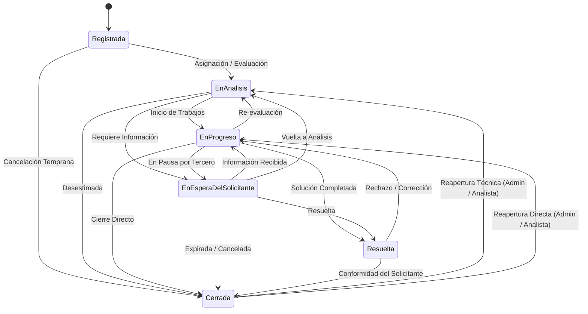

# Evidencias de Ejecución y Guía Visual de Procesos

Documento completo de evidencias funcionales, ejecución de pruebas automatizadas y flujos operativos del **Sistema de Gestión de Solicitudes Internas** de la **Superintendencia de Bancos (SB)**.

---

## 🧪 1. Evidencia de Ejecución de Pruebas Automatizadas Backend (`dotnet test`)

```powershell
dotnet test src/backend/SB.GestionSolicitudes.sln
```

```text
  Determining projects to restore...
  All projects are up-to-date for restore.
  SB.GestionSolicitudes.Domain -> C:\Users\Elite\Desktop\SB practica\sb-gestion-solicitudes\src\backend\SB.GestionSolicitudes.Domain\bin\Debug\net8.0\SB.GestionSolicitudes.Domain.dll
  SB.GestionSolicitudes.Application -> C:\Users\Elite\Desktop\SB practica\sb-gestion-solicitudes\src\backend\SB.GestionSolicitudes.Application\bin\Debug\net8.0\SB.GestionSolicitudes.Application.dll
  SB.GestionSolicitudes.Services -> C:\Users\Elite\Desktop\SB practica\sb-gestion-solicitudes\src\backend\SB.GestionSolicitudes.Services\bin\Debug\net8.0\SB.GestionSolicitudes.Services.dll
  SB.GestionSolicitudes.Infrastructure -> C:\Users\Elite\Desktop\SB practica\sb-gestion-solicitudes\src\backend\SB.GestionSolicitudes.Infrastructure\bin\Debug\net8.0\SB.GestionSolicitudes.Infrastructure.dll
  SB.GestionSolicitudes.Api -> C:\Users\Elite\Desktop\SB practica\sb-gestion-solicitudes\src\backend\SB.GestionSolicitudes.Api\bin\Debug\net8.0\SB.GestionSolicitudes.Api.dll
  SB.GestionSolicitudes.Tests -> C:\Users\Elite\Desktop\SB practica\sb-gestion-solicitudes\src\backend\SB.GestionSolicitudes.Tests\bin\Debug\net8.0\SB.GestionSolicitudes.Tests.dll
Test run for C:\Users\Elite\Desktop\SB practica\sb-gestion-solicitudes\src\backend\SB.GestionSolicitudes.Tests\bin\Debug\net8.0\SB.GestionSolicitudes.Tests.dll (.NETCoreApp,Version=v8.0)
A total of 1 test files matched the specified pattern.

Passed!  - Failed:     0, Passed:    36, Skipped:     0, Total:    36, Duration: 5 s - SB.GestionSolicitudes.Tests.dll (net8.0)
```

---

## 🌐 2. Evidencia de Compilación de Producción Frontend (`npm run build`)

```powershell
cd src/frontend
npm run build
```

```text
▲ Next.js 16.3.3 (Turbopack)
✓ Running next.config.ts took 53ms

  Creating an optimized production build ...
✓ Compiled successfully in 1935ms
  Running TypeScript ...
  Finished TypeScript in 4.0s ...
  Collecting page data using 7 workers ...
  Generating static pages using 7 workers (0/11) ...
  Generating static pages using 7 workers (2/11) 
  Generating static pages using 7 workers (5/11) 
  Generating static pages using 7 workers (8/11) 
✓ Generating static pages using 7 workers (11/11) in 754ms
  Finalizing page optimization ...

Route (app)
┌ ○ /
├ ○ /_not-found
├ ○ /admin/catalogos
├ ○ /admin/entidades
├ ○ /admin/usuarios
├ ○ /dashboard
├ ○ /login
├ ○ /solicitudes
├ ƒ /solicitudes/[id]
└ ○ /solicitudes/nueva

○  (Static)   prerendered as static content
ƒ  (Dynamic)  server-rendered on demand
```

---

## 🎭 3. Evidencias de Pruebas E2E y Capturas Automatizadas

El proyecto incluye dos herramientas complementarias con Playwright:
1. **Suite de Pruebas E2E Formales con Aserciones (`npm run test:e2e`):** Valida formalmente mediante `@playwright/test` y aserciones `expect()` la carga de elementos institucionales, protección de rutas y formularios.
2. **Generador de Evidencias Visuales y Capturas por Rol (`npm run test:screenshots`):** Ejecuta la navegación integral simulando cada rol institucional (`Administrador`, `Analista IT`, `Solicitante`) y exporta 21 capturas en alta resolución en `docs/screenshots/`.

---

## 🖥️ 4. Guía de Flujos Operativos y Capturas Visuales del Sistema

### 📌 Flujo 1: Autenticación Institucional y Control de Acceso
El sistema cuenta con inicio de sesión seguro mediante JWT Bearer y selector de cuenta para agilizar pruebas en la pantalla de login:

- **Administrador:** `admin@sb.gob.do` / `Admin123!` $\rightarrow$ Acceso total a administración, reasignación, usuarios y catálogos.
- **Analista IT:** `analista.tech@sb.gob.do` / `Analista123!` $\rightarrow$ Gestión técnica, asignación, notas internas y cambios de estado.
- **Solicitante:** `juan.perez@sb.gob.do` / `User123!` $\rightarrow$ Creación, edición en estado inicial y consulta exclusiva de sus requerimientos.

---

### 📌 Flujo 2: Tablero de Control / Dashboard de Métricas
Visualiza en tiempo real los indicadores clave y cumplimiento de SLAs:
- **KPIs Principales:** Total de Solicitudes, Solicitudes Abiertas, Resueltas/Cerradas y **Solicitudes Vencidas** en rojo institucional.
- **Gráficos Donut SVG Nativos:** Distribución por Estado (`Registrada`, `En Análisis`, `En Progreso`, `En Espera`, `Resuelta`, `Cerrada`) y por Prioridad (`Baja`, `Media`, `Alta`, `Crítica`).
- **Tabla de Actividad Reciente:** Accesos directos a los últimos registros ingresados.

---

### 📌 Flujo 3: Creación de Solicitudes de Soporte (`/solicitudes/nueva`)
Permite registrar un nuevo requerimiento tecnológico:
1. **Título** (hasta 150 caracteres) y **Descripción Detallada** (hasta 2000 caracteres).
2. **Selección de Área Destino** (Catálogo activo).
3. **Selección de Tipo de Solicitud** (Catálogo activo).
4. **Nivel de Prioridad** (`Baja`, `Media`, `Alta`, `Crítica`).
5. **Fecha Compromiso SLA** y **Referencia / Evidencia Física o Digital**.
6. Al guardar, el backend asigna el código correlativo institucional (e.g. `SOL-2026-0001`), genera el evento de dominio `SolicitudCreadaEvent` y notifica al usuario.

---

### 📌 Flujo 4: Consulta de Solicitudes con Alcance de Seguridad (`/solicitudes`)
Bandeja centralizada con filtros avanzados:
- **Buscador global:** Código (`SOL-2026-0001`), título o descripción.
- **Filtros por selectores:** Estado, Prioridad, Área, Rango de Fechas.
- **Data Scoping Estricto (Restricción por Rol):**
  - `Solicitante`: Únicamente visualiza sus propias solicitudes (`SolicitanteId == CurrentUserId`).
  - `Analista`: Visualiza sus solicitudes asignadas (`ResponsableId == CurrentUserId`) y las solicitudes disponibles sin asignar (`ResponsableId == null`).
  - `Administrador`: Acceso global a todo el universo de solicitudes.

---

### 📌 Flujo 5: Detalle, Asignación y Comentarios (`/solicitudes/{id}`)
Vista integral 360° del requerimiento:
- **Encabezado:** Código, badges de estado y prioridad, y alerta visual si la solicitud está **Vencida**.
- **Panel de Clasificación:** Área, tipo, usuario solicitante, analista responsable y fechas clave.
- **Línea de Tiempo de Trazabilidad:** Historial de auditoría inmutable con cada cambio de estado, fecha, hora y usuario responsable.
- **Muro de Comentarios:**
  - Comentarios Públicos (visibles para el solicitante y analistas).
  - **Notas Internas Protegidas:** Solo visibles para `Analista` y `Administrador` con candado distintivo.

---

### 📌 Flujo 6: Edición Parcial de Solicitudes (Modal)
Permite modificar el contenido de una solicitud existente:
- **Accesibilidad:** Disponible para `Administrador`, `Analista` o para el `Solicitante` autor mientras la solicitud esté en `Registrada` o `En Espera del Solicitante`.
- **Campos Editables:** Título, Descripción, Área, Tipo, Prioridad, Fecha Compromiso y Referencia de Evidencia.
- **Auditoría:** Registra la fecha de modificación y actualiza la vista reactivamente.

---

### 📌 Flujo 7: Transiciones Formales de Estado (Matriz `SolicitudTransiciones`)
Control formal del ciclo de vida de requerimientos:

- **Regla de Cierre:** Al pasar a estado `Cerrada`, se exige obligatoriamente ingresar la justificación o solución entregada.
- **Regla de Reapertura:** Una solicitud en estado `Cerrada` solo puede ser reabierta por un usuario con rol `Administrador` o `Analista`.

---

### 📌 Flujo 8: Bandeja de Notificaciones en Header
Centro de notificaciones reactivo:
- **Icono de Campana con Badge:** Muestra el contador de alertas pendientes.
- **Panel Desplegable:** Lista las notificaciones ordenadas cronológicamente con asunto, detalle y fecha.
- **Navegación Rápida:** Al hacer clic en una notificación, redirige directamente al detalle de la solicitud vinculada.
- **Persistencia Atómica:** Notificaciones guardadas en base de datos dentro de la misma transacción del negocio.

---

### 📌 Flujo 9: Mantenimiento de Entidades Gubernamentales (`/admin/entidades`)
Catálogo oficial del Estado Dominicano basado en `ListaEntidadesGubernamentales.xlsx` (**181 entidades oficiales**):
- **Campos Oficiales Persistidos:** `Nombre`, `Categoría`, `Poder del Estado`, `Sector`, `Activo`.
- **Filtros en Cascada:** Filtrado simultáneo por Sector (`Hacienda`, `Salud`, `Educación`, etc.), Poder del Estado (`Poder Ejecutivo`, `Poder Judicial`, etc.) y Categoría Funcional.
- **Acciones:** Búsqueda en tiempo real, creación, edición y activación/suspensión instantánea.

---

### 📌 Flujo 10: Mantenimiento de Catálogos (`/admin/catalogos`)
Panel con pestañas para administrar las tablas auxiliares:
- **Pestaña 1 (Áreas):** Crear y editar áreas de la institución, alternar estado activo/inactivo.
- **Pestaña 2 (Tipos de Solicitud):** Configurar tipos de servicio técnico con validación de nombres únicos.

---

### 📌 Flujo 11: Gestión de Usuarios del Sistema (`/admin/usuarios`)
Administración completa de cuentas y accesos:
- **Listado y Filtros:** Buscador por nombre/correo y selector por rol de seguridad (`Administrador`, `Analista`, `Solicitante`).
- **Creación de Usuarios:** Asignación de rol institucional y hashing seguro de contraseñas con **BCrypt**.
- **Modificación y Reseteo:** Edición de nombres, correos y actualización opcional de contraseña.
- **Control de Acceso:** Botón para activar o suspender el acceso de cualquier cuenta con 1 clic.
